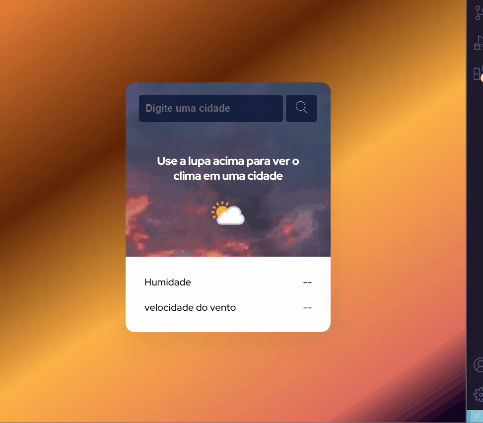

# Aplicativo De previsão do tempo 

Nesse projeto usando api que retorna informações sobre o clima,  Digitando o nome da cidade que você deseja de forma instantanea e em tempo real , aparecem informações sobre o clima 🌦️☀️🌡️

## Linguagens utilizadas: 💻
- Html
- Css
- Javascript 
 

## Conceitos praticados

Foi um projeto muito bacana onde pude por em prática conceitos muito importantes e amplamente usados na criação de sites e aplicativos. 
Estruturação Html, estilização e posicionamento com css e flex-box interação com javascript Criação de variáveis e funções,  integração com API. 

### link do projeto

Clique e busque informções do clima da sua cidade😊

https://johnnyribeiro34.github.io/Projeto-App-de-previs-o-do-tempo/

